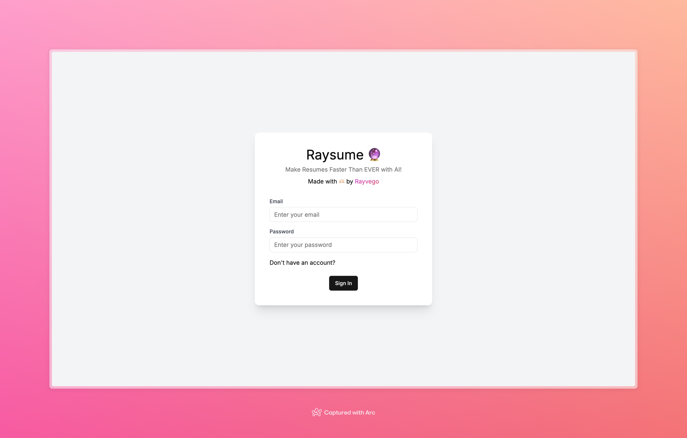

# Raysume 🔮: Make your Resume Faster than Ever with AI

## Introduction
This project is a part of the IIT Gandhinagar 24' Software Development Club Hackathon. More about that below.

This project is a web-based application that helps users create resumes quickly by using the Groq AI API with minimal effort.

Users input their personal and professional details, and the app will automatically generate a well-structured, polished resume in a professional format.

The idea is to simplify the process of creating a resume by providing suggestions and formatting tips.

### IIT Gandhinagar 24' Software Development Club Hackathon

#### Problem Statement: Resume Builder using OpenAI/Groq AI API

The goal of this project is to build a web-based application that helps users create resumes quickly by using the OpenAI API/Groq AI API with minimal effort. Users will input their personal and professional details, and the app will automatically generate a well-structured, polished resume in a professional format. The idea is to simplify the process of creating a resume by providing suggestions and formatting tips.

#### Evaluation Criteria

1. Functionality: The website should perform the core tasks effectively—taking user input, generating content with the OpenAI API, and creating both PDF and LaTeX resumes.
2. Ease of Use: The application should have a simple and intuitive user interface. Users shouldn’t struggle to input their data or download the resume in both formats.
3. Content Quality: The AI-generated suggestions should be relevant and well-suited to the user’s input, making the resume content stand out in a professional way.
4. API Usage: Ensure the efficient use of the OpenAI API, minimizing token usage while still generating high-quality content.

## Features

Main Features of the Project:
1. **AI Powered Content Suggestions**: The project uses the Groq API to generate resume content, generate questions, provide suggestions, review the resume and give valuable feedback and more.

2. **User Authentication**: The project uses Firebase Authentication to authenticate users and store their data securely.

3. **Resume Generation**: The project generates resumes in Mardown format as of now,  PDF and LaTeX formats will be supported in future versions!

4. **Real-Time Resume Preview**: The project provides a preview of the resume generated in Markdown format. The preivew is updated in real-time as the user inputs data.

5. **User Input Form**: The project provides a form for the user to input their personal and professional details. The form is designed to be user-friendly and intuitive. It updates the resume preview in real-time.

6. **System Prompts**: The project provides prompts to the user to input data in a structured manner. This helps the AI generate better content

7. **Efficient Token API Usage**: The project optimizes the usage of the Groq API tokens to minimize costs. The project uses the tokens efficiently to generate high-quality content.

## Tech Stack
1. NextJS
2. Appwrite Authentication and Database
3. Typescript and Zod
4. Groq API - Gemma 7B Model
5. TailwindCSS and ShadCN

## Project Structure
All files are organized in a structured manner and each file has a specific purpose which is explained via comments in the file.

The project is structured as follows:
- `app`: Contains the NextJS application.
- `components`: Contains the React components used in the project.
- `lib`: Contains the utility functions used in the project.
- `types`: Contains the types used in the project.
- `public`: Contains the public assets used in the project.

### Deeper Dive into the Project Structure
#### @app/
- `(auth)`: Contains the authentication pages of the project.
- `(root)`: Contains the main pages of the project.
   - `editor/[fileId]`: Contains the main editor page of the project consisting of the input form, resume preview and AI Chat Bot.
   - `page.tsx`: Contains the main page of the project.

#### @app/api/
- Contains all the API routes used in the project such as chatbot, review resume, sections, generating questions and skills, etc.

#### @components/
- `ui` - Contains the ShadCN components used in the project.
- Rest of the components are organized based on their functionality.

#### @lib/actions/
- `user.actions.ts`: Contains the main logic of the entire application - login, sign up, logout, CRUD operations for documents, etc.

#### @lib/
- `groq.ts`: Contains the functions to interact with the Groq API.
- `appwrite.ts`: Contains the functions to interact with the Appwrite API.
- `utils.ts`: Contains the utility functions used in the project such as parsing time, parseStringify, etc.
- `prompt.ts`: Contains the system prompts used in the project.
- `pdfGeneration.ts`: Contains the functions to generate Markdown resumes.

## Future Enhancements
1. **PDF and LaTeX Resume Generation**: The project will support PDF and LaTeX resume generation in future versions.
2. **Resume Templates**: The project will support multiple resume templates in future versions.
3. **User Profile**: The project will support user profiles in future versions.
4. **Resume Sharing**: The project will support sharing resumes in future versions.
5. **Resume Analytics**: The project will support analytics for resumes in future versions.

## Learnings
1. **Groq API and AI Integration**: I learned how to integrate the Groq API with the project and use the Gemma 7B model to generate resume content and suggestions.
2. **Appwrite Revision**: It was a good revision of Appwrite and how to use it for authentication and database.
3. **TailwindCSS along with ShadCN and React Hot Toast**: I learned how to use TailwindCSS for styling the project and make it responsive.
4. **Typescript and Zod**: I learned how to use Zod for type checking and validation in the project.
5. **NextJS**: I gained deeper understanding of NextJS and how to use it for building web applications.

## Deployement
The project is deployed on Vercel. You can access the project [here](https://resume-builder-induction-contest.vercel.app/).

## Screenshots

